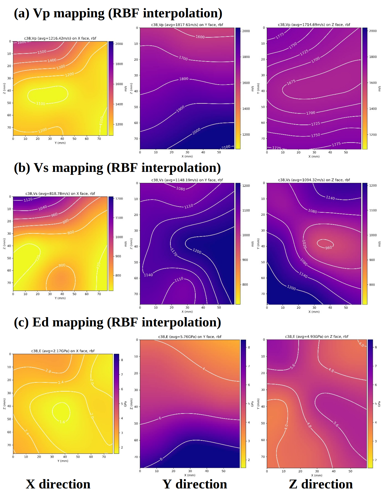
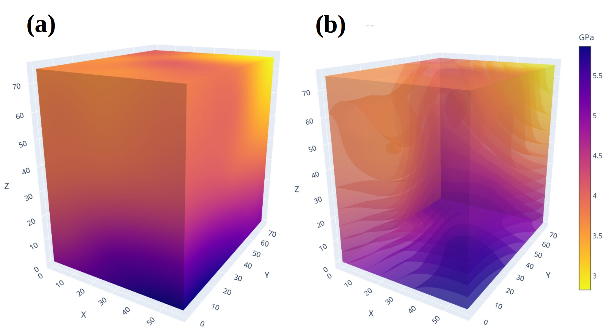
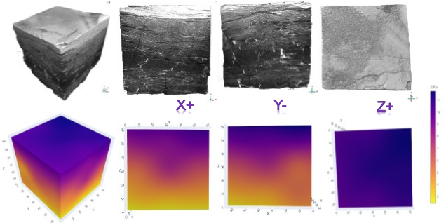

# 3D Sonic Mapping for Coal Samples

This repository contains code and data for a novel sonic mapping method applied to coal samples. The method utilizes non-destructive sonic tests and CT scan imaging for validation, enabling detailed visualization of the internal structure of coal samples.

## Abstract

This study presents a novel sonic mapping method applied to coal samples, verified by CT scan imaging. Cubic coal samples with side lengths of 50-70 mm were subjected to non-destructive sonic tests, measuring both P-wave (Vp) and S-wave (Vs) velocities. Each of the three orthogonal directions (X, Y, and Z) of the cube was divided into 9 regions, resulting in 27 Vp and 27 Vs measurements per sample. From these data, 2D sonic maps were constructed for each direction, and interpolation was employed to refine the mappings. A 3D sonic map was then generated by averaging the 2D maps. The 3D sonic mapping results were compared and validated against high-resolution CT scan images, confirming the reliability of this approach for mapping the internal structure of coal samples.








## Table of Contents

- [Overview](#overview)
- [Methodology](#methodology)
- [Repository Structure](#repository-structure)
- [Installation](#installation)
- [Usage](#usage)
- [Data](#data)
- [Contributing](#contributing)
- [License](#license)
- [Contact](#contact)

## Overview

The primary objective of this project is to implement and validate a sonic mapping technique that constructs detailed 2D and 3D maps of coal samples. The method involves:
- **Sonic Testing:** Measuring P-wave (Vp) and S-wave (Vs) velocities across 27 regions per sample.
- **2D Mapping:** Constructing individual sonic maps along the X, Y, and Z directions.
- **3D Reconstruction:** Averaging the 2D maps to generate a comprehensive 3D sonic map.
- **Validation:** Comparing the sonic maps with high-resolution CT scan images to ensure accuracy.

## Methodology

1. **Sonic Data Acquisition:** 
   - Each coal cube is divided into 9 regions per orthogonal direction.
   - Both Vp and Vs velocities are measured, yielding 27 readings per wave type per sample.

2. **2D Sonic Map Construction:**
   - Data is processed to form a 2D map for each direction (X, Y, and Z).
   - Interpolation techniques are applied to enhance the resolution and smooth the maps.

3. **3D Sonic Mapping:**
   - The three 2D maps are averaged to produce a final 3D sonic representation.
   - The resulting map is then validated against CT scan imaging data.

## Repository Structure

├── data/                  # Raw measurement data                 
│   
├── coalpro/
│   ├── utils.py            # Core algorithms for 2D and 3D mapping
│   │                        # Interpolation routines for refining maps
│   └── visualize.py        # Tools for visualizing the results
├── notebooks/
│   └── coal_3D_rev3.ipynb   # Jupyter notebooks for mapping computing and visualization
├── README.md               # This file
└── LICENSE                 # Licensing information

## Installation

### Prerequisites

- Python 3.7 or later
- Required Python libraries:
  - NumPy
  - SciPy
  - Matplotlib
  - Pandas
  - scikit-image (for CT image processing)

### Steps

1. **Clone the repository:**
   ```bash
   git clone https://github.com/yourusername/3D-sonic-mapping.git
   cd 3D-sonic-mapping
   ```

2. **Create and activate a virtual environment (optional but recommended):**
   ```bash
   python -m venv env
   source env/bin/activate  # On Windows use: env\Scripts\activate
   ```


## Usage

### Running the Mapping Algorithm

To generate the 2D and 3D sonic maps, run the main script:

Jupyter notebooks are provided for exploring the sonic mapping process and comparing the results with CT scan images:
```bash
jupyter notebook notebooks/coal_3D_rev3.ipynb
```

## Data

- **Raw Data:** Stored in the `data/` directory. This includes sonic measurements and corresponding CT scan images.
- **Processed Data:** The results of the mapping and validation are saved in the `Results/` directory.

## Contributing

Contributions are welcome! If you would like to contribute:
1. Fork the repository.
2. Create a new branch: `git checkout -b feature-branch`
3. Commit your changes: `git commit -m 'Add feature or fix bug'`
4. Push to the branch: `git push origin feature-branch`
5. Open a pull request.

For major changes, please open an issue first to discuss what you would like to change.

## License

This project is licensed under the MIT License. See the [LICENSE](LICENSE) file for more details.

## Contact

For any questions or feedback, please reach out to:

- **Jimmy Li** - Jimmy.Li@uq.edu.au  

```

---
